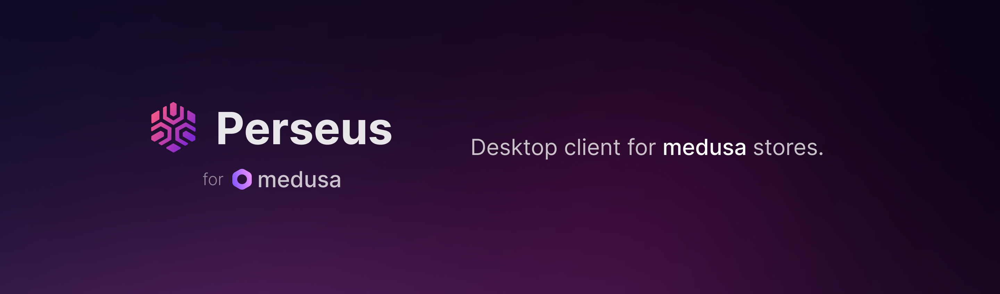
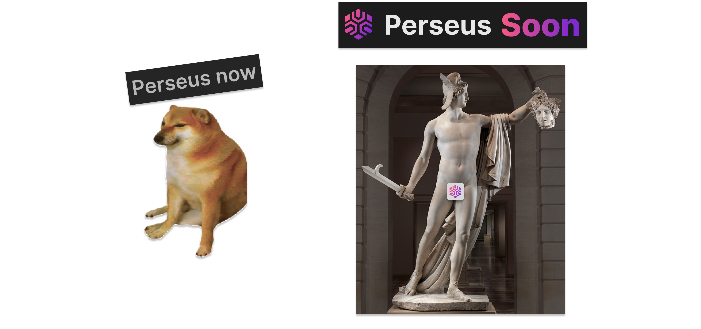
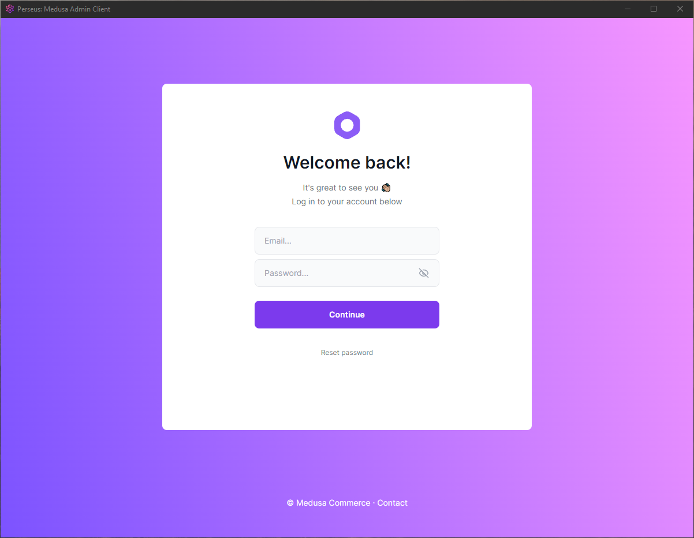
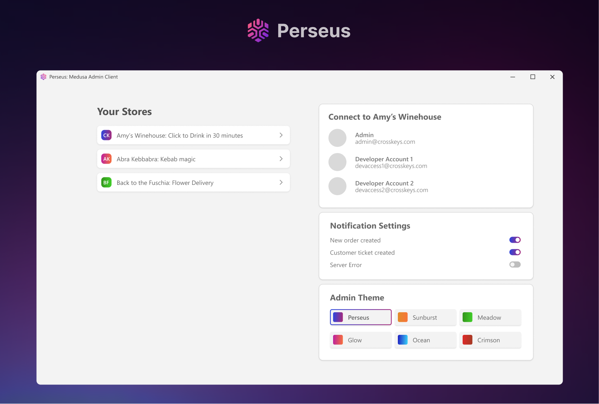

# Perseus: Cross-platform admin client for medusa

Just like in the myth, Perseus will help you smite all of the challenges of managing all of your **medusa** stores.

A _very_ early version of a medusa desktop client. At this point, it is mostly a wrapper of the default **medusaJS** admin site. However, it's final form will be radically different.

Although the idea was born as a fun concept, with limited actual utility, maybe it could be used by someone for some actual use.

In the future it could be useful for anyone with a few medusa stores



## NOTE: do not use in production - its not safe

## Screenshot



# (Future) features

- Built with Tauri app - a better Electron alternative.
- Dashboard - allowing one click access to many webstore admins from one place.
- Admin themes - user defined color themes.
- Fix issue of having to add localhost to backend CORS. Solution will allow simply adding admin URLs within the app.
- Native desktop notifications.
- Much more.



## Medusa Prerequisites

Technically, the project itself does not have any strict medusa dependencies. However, a running medusa backend would allow you to get beyond the login screen.

## Getting Started

1.  **Install Tauri Prerequisites**

Because the project is built using Tauri, its prerequisites must be met.

They include Rust lang and Visual Studio C++ Build Tools for windows. For MacOS Tauri requires CLang and macOS development tools.

Specifics and how to install can be found here: [Tauri Prerequisites](https://tauri.app/v1/guides/getting-started/prerequisites)

2.  **Install dependencies**

```
yarn
```

3. **Add your medusa backend CORS URL to evironment variables**

If running in development (yarn tauri dev)

```
// .env.development

GATSBY_MEDUSA_BACKEND_URL=<ADMIN_CORS_URL>

```

For production (yarn tauri build)

```
// .env.production

GATSBY_MEDUSA_BACKEND_URL=<ADMIN_CORS_URL>

```

3.  **Start dev server**

```
yarn tauri dev
```

Be forewarned, the initial build might take a while as both Gastby and Tauri are quite phat. Though subsequent builds are much quicker as they update changes.

4.  **Optional: start only Gatsby server**

```bash
yarn start
```

## Config

All config at this time is all thats available in medusa and in Tauri (available in tauri.config.json - more info on tauri.app).

More to come soon.

## Once again, do not use in production. Its not ready.
